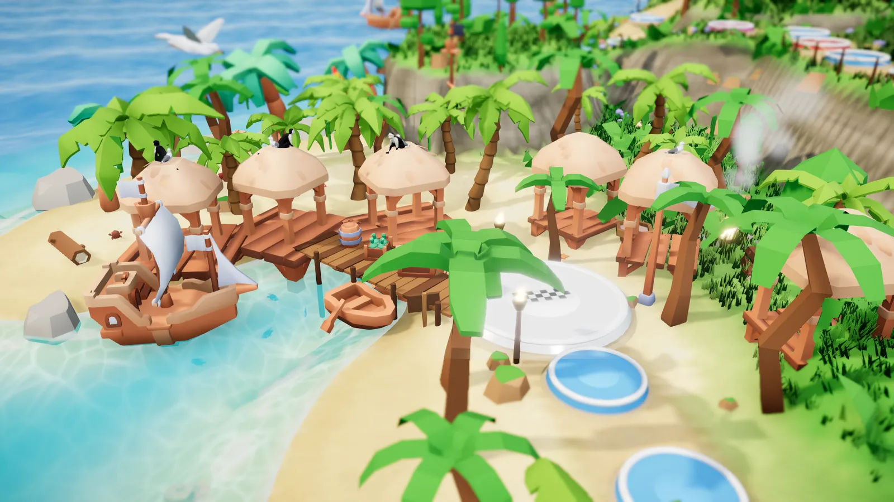
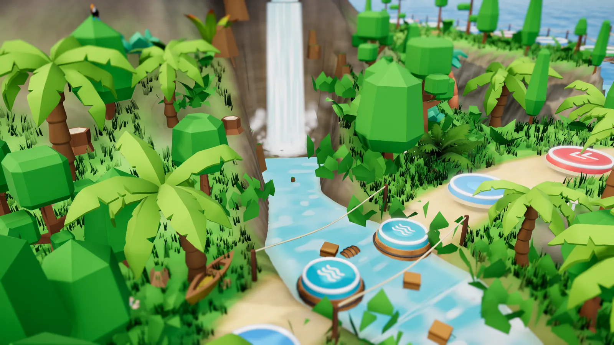
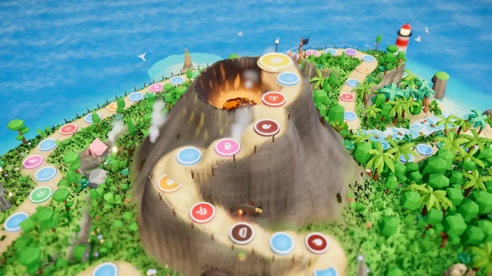
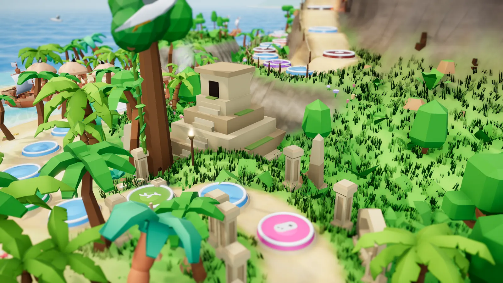
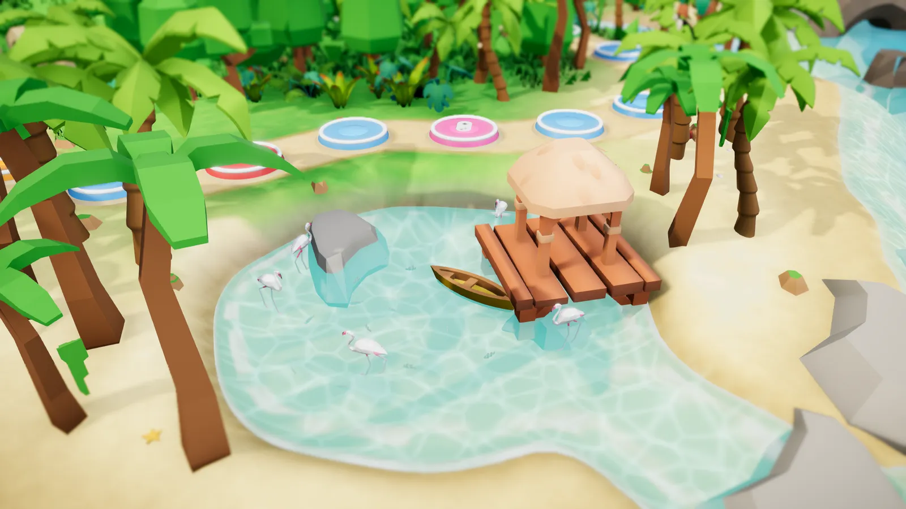
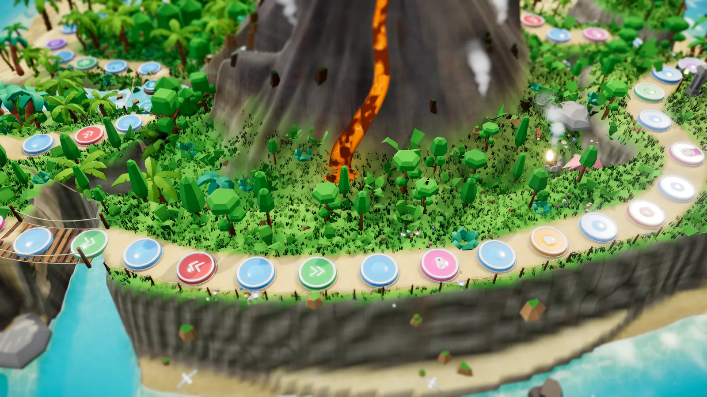

# 🏝️ Insel der Abenteuer

Ein Partyspiel für Gruppen im Stil von **Wii Party**: Die Teams wandern auf einer 3D-Insel vom Hafen bis zum Vulkangipfel. Wer welche Strecke würfeln darf, entscheiden Minispiele und Quizfragen, die live vor Ort gespielt werden. Gedacht für Jugendgruppen, Freizeiten, Klassenfahrten und Familienfeste mit **2–10 Teams**.


## Die Insel

Der Weg führt vom **Hafendorf** an der **Liane** vorbei durch die **Tempelruinen**, an der **Lagune** vorbei durch den **Dschungel**, über **Fässer im Fluss** unter dem Wasserfall, zum **Leuchtturm**, über die **Hängebrücke**, an der Steilküste entlang zu den **Steinköpfen** und in Serpentinen auf den **Vulkan** – vorbei an der **Lavahöhle** bis zum **Kraterloch**. Jedes Sonderfeld hat seinen Auftritt: Sprungfeder, Doppeldecker mit Fallschirm, UFO-Tausch, fallender Käfig, Dampf-Geysir. Unterwegs: Delfine, ein Wal, Fischschwärme, Flamingos, Schildkröten, Krabben, Frösche, Papageien, Affen, Möwen und Schmetterlinge.

Nach jedem Zug reagiert die Figur in der Großaufnahme (Salto, Jubel, Ärger …), ein **Kommentator** begleitet das Spiel mit Sprüchen, eigene **Musik** wechselt je nach Phase, und am Ende steigt ein **Siegerpodest aus dem Krater**. Eine **Spielerklärung** mit Sprecher zeigt in gut zwei Minuten, wie alles funktioniert.

| | | |
|---|---|---|
|  |  |  |
|  |  |  |

## Die vier Bildschirme

| Wer | Was | Adresse |
|---|---|---|
| **Beamer** | 3D-Insel mit Figuren, Fragen, Ergebnissen, Würfeln und Effekten – ohne Menü, komplett aus der Regie gesteuert | `/beamer` (Kiosk: `./start.sh beamer`) |
| **Regie** (Technik) | Steuert den Abend: Inhalte wählen, Antworten sehen, Platzierung eintragen, würfeln, Rückgängig; Beamer fernsteuern (Grafik, Ton, Musik, Kamera, Erklärung) | `/regie` |
| **Moderator** (Vorleser) | Große Vorleseansicht mit Lösungen – kann alles mitsteuern | `/moderator` |
| **Handys / Tablets** | Teams treten per QR-Code bei, antworten, buzzern, würfeln, gestalten ihre Figur | `/` → „Mitspielen“ |

Alle Geräte sind live verbunden – jede Aktion erscheint sofort überall.

| Beamer | Regie | Handy |
|---|---|---|
|  |  |  |

## Schnellstart

Voraussetzung: [Docker Desktop](https://www.docker.com/products/docker-desktop/) läuft.

```bash
cp .env.example .env        # dann ADMIN_PASSWORD in .env setzen
./start.sh                  # baut und startet alles, öffnet die Regie
```

Danach:

1. **Regie** öffnen (`http://localhost:8080/regie`) und ein Spiel anlegen.
2. **Beamer** öffnen: `./start.sh beamer` (Kiosk mit Vollbild und Ton) oder `http://localhost:8080/beamer` und einmal hineinklicken – dort erscheint der QR-Code zum Mitspielen.
3. Handys scannen den QR-Code (gleiches WLAN), Teams bilden, **Spiel starten**.

Für Zugriff übers Internet (z. B. Handys mit mobilen Daten): `./start.sh online` – siehe [Betrieb](docs/betrieb.md).

## Dokumentation

| Kapitel | Für wen |
|---|---|
| [Spieleabend durchführen](docs/spielleitung.md) | Regie & Moderator: Ablauf, Checkliste, Tipps |
| [Spielregeln](docs/spielregeln.md) | Alle: Runden, Bonuswürfel, Sonderfelder, Fässer im Fluss, Kraterloch, Vulkan, Sieg |
| [Inhalte erstellen](docs/inhalte.md) | Vorbereitung: Spiele, Fragen, Feld-Minispiele, Import/Export |
| [Betrieb & Installation](docs/betrieb.md) | Technik: Docker, WLAN, Internet, Server, Backups, Fehlerbehebung |
| [Architektur](docs/architektur.md) | Entwickler: Aufbau, Datenfluss, Erweiterungen |
| [Entwicklung](docs/entwicklung.md) | Entwickler: lokal starten, Tests, Werkzeuge |
| [Umstieg von Version 1](docs/umstieg.md) | Was aus der alten Flask-Version wurde |

## Technik in Kürze

TypeScript-Monorepo: **Spiel-Engine** (reine Logik, getestet) · **Server** (Fastify, Socket.IO, SQLite) · **Weboberfläche** (React, Tailwind, Three.js). Alle Bibliotheken und Assets liegen lokal – das Spiel funktioniert auch ohne Internet. 3D-Modelle, Himmel und Sounds sind frei lizenziert (überwiegend CC0 von Kenney, Quaternius und Poly Haven, einige Tiere CC-BY mit Namensnennung), siehe [Lizenzen](packages/web/public/assets/LICENSES.md).
