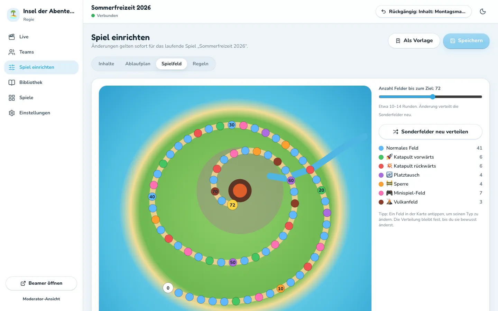
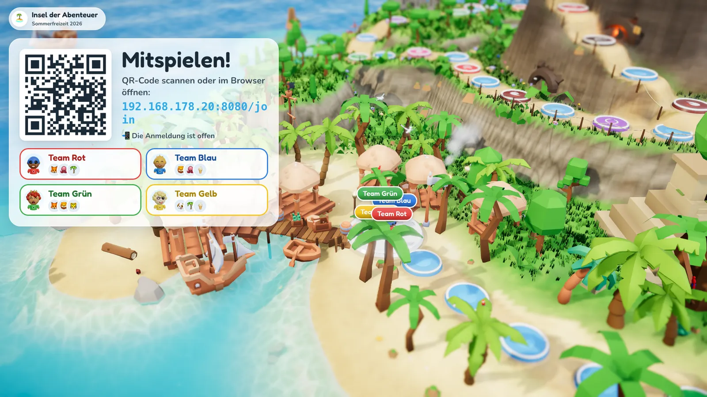
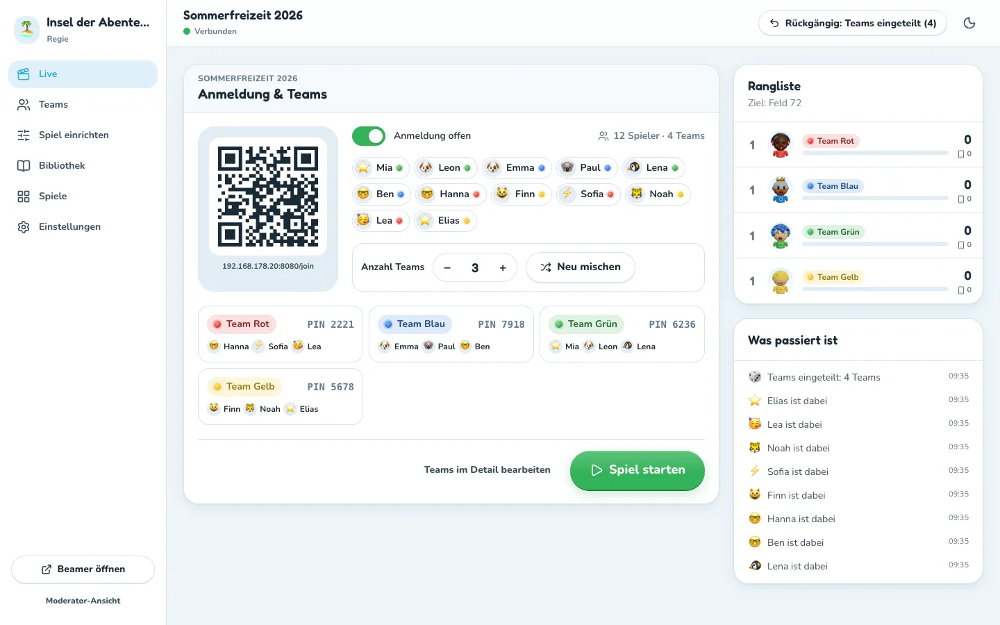
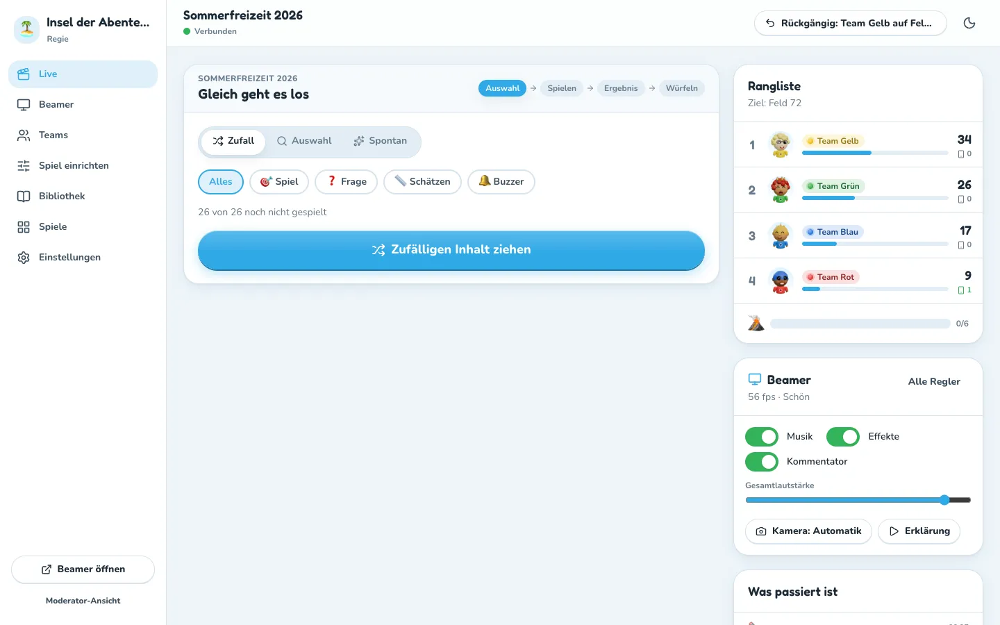
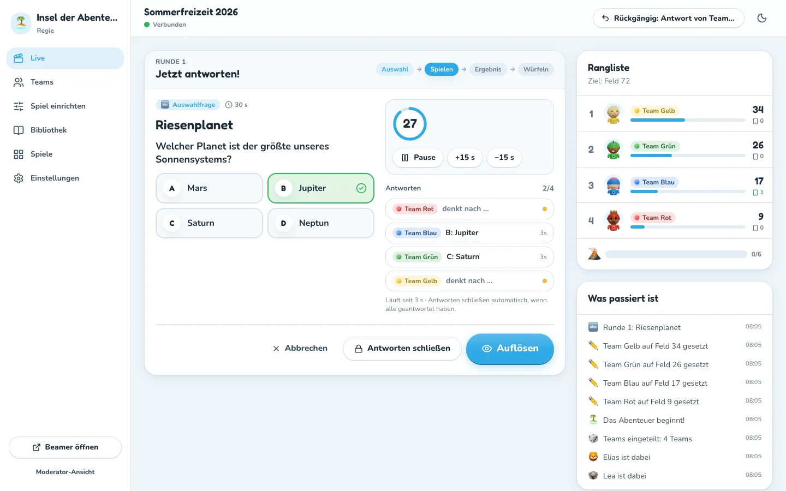
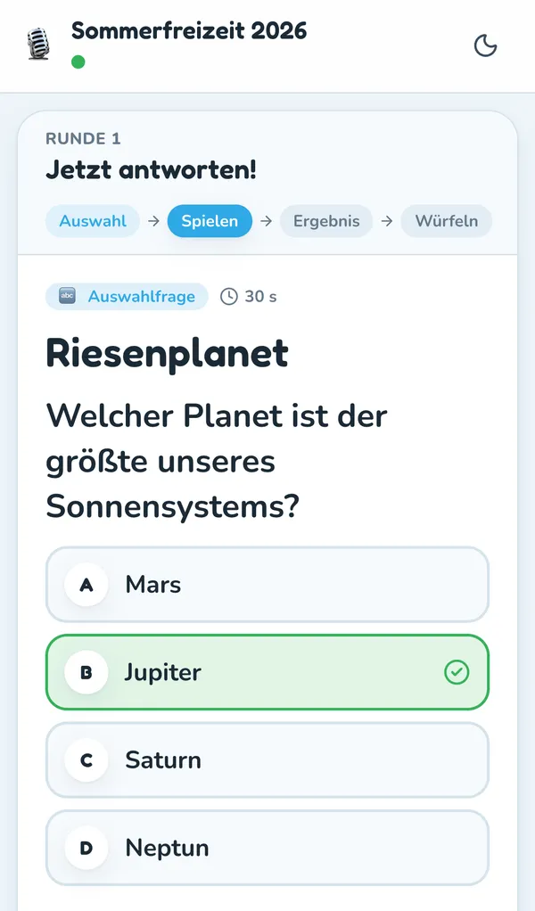
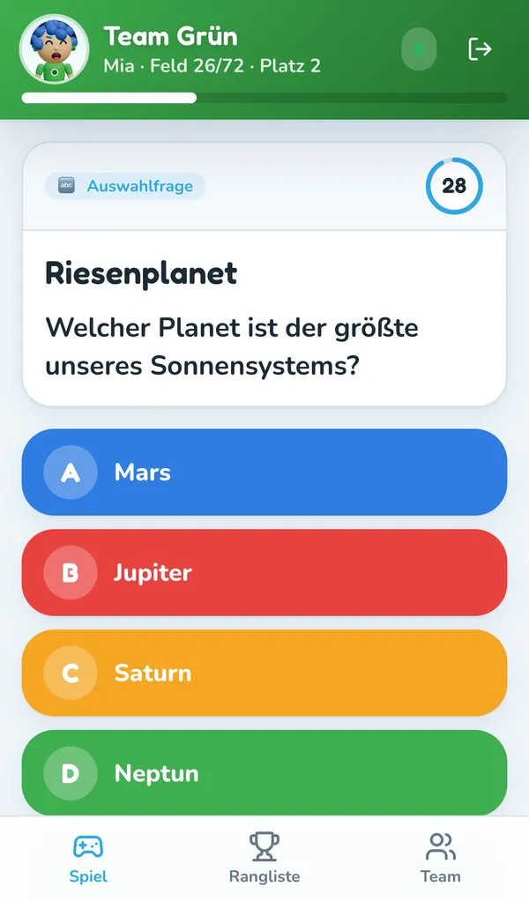
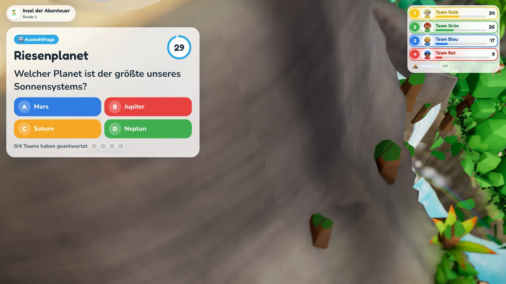
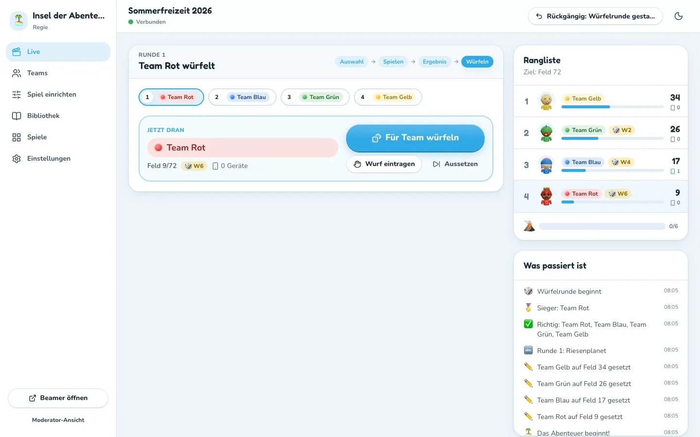
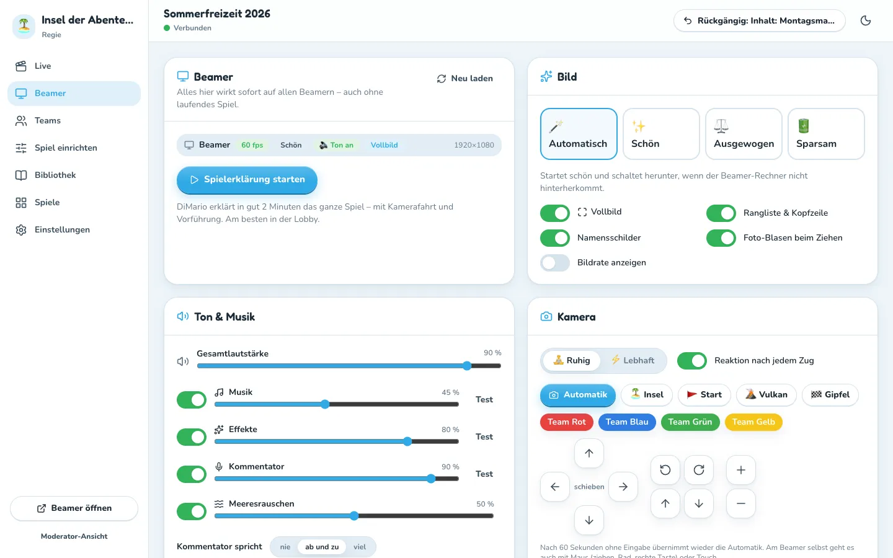

# Spieleabend durchführen

Diese Anleitung ist für die beiden Personen, die den Abend leiten:

- **Regie** (Technik): sitzt am Laptop, steuert alles in der Regie-Ansicht.
- **Moderator** (Vorleser): steht vorne, liest Fragen und Regeln vor, sieht die Lösungen auf dem Handy oder Tablet und kann ebenfalls steuern.

Beide arbeiten gleichzeitig am selben Spiel. Wer zuerst klickt, gewinnt – die Ansichten aktualisieren sich sofort.

## Vorher (am Vortag oder vor Ort)

1. **Laptop vorbereiten**: Docker Desktop starten, im Projektordner `./start.sh` ausführen. Die Regie öffnet sich im Browser.
2. **Passwort**: Das Regie-Passwort steht in der Datei `.env` (`ADMIN_PASSWORD`).
3. **Inhalte prüfen**: Unter *Bibliothek* die Sammlungen ansehen, ggf. eigene Spiele und Fragen anlegen (siehe [Inhalte erstellen](inhalte.md)).
4. **Spiel anlegen**: Unter *Live* (oder *Spiele*) ein neues Spiel aus einer Vorlage erstellen, z. B. „Standard (72 Felder)“ für einen ganzen Abend oder „Kurzes Spiel (40 Felder)“ für ca. 45–60 Minuten.
5. **Spiel einrichten** (optional):
   - *Inhalte*: welche Sammlungen in diesem Spiel vorkommen.
   - *Ablaufplan*: feste Reihenfolge von Spielen/Fragen per Drag & Drop.
   - *Spielfeld*: Länge des Weges, Sonderfelder neu verteilen oder einzeln antippen und ändern. Die **Fässer im Fluss** und das **Kraterloch** gehören fest zur Insel (markiert mit „fest“).
   - *Regeln*: Bonuswürfel, Siegbedingung, Katapulte, Sperre, Vulkan, Sturzgefahr auf den Fässern, Augen zum Herausklettern aus dem Krater …
   Danach **Speichern** – oder mit **Als Vorlage** für spätere Abende sichern.

   
6. **Beamer**: Am besten mit `./start.sh beamer` öffnen – das startet Chrome/Edge als Kiosk im Vollbild, Ton läuft sofort. Alternativ `/beamer` im Browser öffnen (Knopf *Beamer öffnen* in der Regie), auf den Beamer ziehen und **einmal hineinklicken** (Browser geben Ton und Vollbild erst nach einem Klick frei). Am Beamer gibt es kein Menü mehr – **alles steuert die Regie unter *Beamer*** (siehe unten), auch bevor das Spiel startet.
7. **Moderator verbinden**: *Einstellungen → Moderator-QR-Code erzeugen* – mit dem Handy der vorlesenden Person scannen. Kein Passwort nötig.
8. **Material** für die Spiele bereitlegen (steht bei jedem Spiel unter „Material“).

## Ankommen: Anmeldung & Teams

1. Der Beamer zeigt automatisch die **Lobby** mit großem QR-Code.

   

2. Alle scannen den Code mit dem Handy, geben ihren **Vornamen** ein, wählen ein **Emoji** und machen optional ein **Selfie**. (Die Fotos erscheinen später, wenn jemand für ein Spiel ausgelost wird.)
3. In der Regie unter *Live* die **Anzahl Teams** wählen (2–10) und **Teams bilden** klicken. Die Spieler werden zufällig und gleichmäßig verteilt. *Neu mischen* geht jederzeit vor Spielbeginn.
4. Feinarbeit unter *Teams*: Namen und Farben ändern, Spieler per Auswahlfeld verschieben, Fotos tauschen, Spieler von der Auslosung ausnehmen (z. B. bei Verletzung).
5. Die Handys wechseln automatisch zur Team-Ansicht. Solange das Spiel noch nicht läuft, steht dort groß **„Gestaltet euer Team!“**: Teamname ändern und Spielfigur gestalten (Haare, Gesicht, Zubehör – das Shirt hat immer die Teamfarbe). Der Beamer zeigt Änderungen sofort. Später geht das jederzeit unter *Team* oder per Tipp auf die Figur oben links.
6. Wer kein eigenes Handy hat: Ein Team-Handy reicht. Weitere Geräte treten mit der **Team-PIN** bei (steht in der Regie und auf den Team-Handys). Unter *Teams → QR-Codes drucken* gibt es eine Druckseite mit QR-Code und PIN pro Team.
7. **Spielerklärung** (empfohlen): Regie → *Beamer* → **Spielerklärung starten**. Der Kommentator erklärt in gut zwei Minuten das ganze Spiel – mit Kamerafahrt über die Insel, Vorführung der Sonderfelder und Untertiteln.
8. **Spiel starten**. Die Anmeldung schließt sich automatisch; Nachzügler kommen mit der Team-PIN rein.

## Eine Runde

Jede Runde hat vier Schritte – oben in der Regie als Leiste sichtbar: **Auswahl → Spielen → Ergebnis → Würfeln**.

### 1. Auswahl

Wähle den nächsten Inhalt:

- **Plan**: nächster Punkt aus dem Ablaufplan.
- **Zufall**: ein noch nicht gespielter Inhalt – auf Wunsch nur Spiele, nur Fragen, nur Schätz- oder Buzzer-Fragen.
- **Auswahl**: Liste mit Suche, Vorschau und Häkchen bei bereits Gespieltem.
- **Spontan**: schnell eine eigene Frage oder ein Spiel eintippen (wird nicht gespeichert).

Bei Spielen werden sofort die **Spieler ausgelost** (fair: wer seltener dran war, kommt zuerst). Mit „neu“ kann pro Team neu gelost werden.

### 2. Spielen

- **Fragen**: *Antworten freigeben* – der Countdown läuft, die Handys zeigen große Antwortknöpfe. In der Regie siehst du live, wer was geantwortet hat. Haben alle geantwortet, schließt die Runde automatisch. Dann **Auflösen**.
  - *Freitext* wird tolerant bewertet (Groß-/Kleinschreibung, Umlaute, Artikel, kleine Tippfehler). Mit ✓/✗ kannst du jede Antwort per Hand werten.
  - *Schätzfrage*: Wer am nächsten dran ist, gewinnt; gleicher Abstand = gleicher Platz.
  - *Buzzer*: Die Handys zeigen einen großen roten Knopf. Die Reihenfolge erscheint sofort; bewerte das erste Team mit *Richtig* oder *Falsch* – bei Falsch ist das nächste dran.
- **Spiele**: *Spiel starten* (optional mit Countdown), dann die **Platzierung eintippen**: Teams in der Reihenfolge ihres Platzes antippen. Für Gleichstand vorher *= Gleichstand* drücken. Nochmal antippen entfernt ein Team.

| Regie | Moderator | Handy | Beamer |
|---|---|---|---|
|  |  |  |  |

### 3. Ergebnis

*Ergebnis zeigen* – der Beamer zeigt die Plätze und die **Bonuswürfel** (Standard: 1. Platz W6, 2. Platz W4, 3. Platz W2; bei Fragen nur für richtige Antworten).

### 4. Würfeln

*Würfelrunde starten*. Die Teams würfeln in der Reihenfolge ihrer Platzierung **am Handy** („Würfeln!“). Auf dem Beamer rollt der 3D-Würfel, die Figur läuft, Sonderfelder lösen aus.

- Die Regie kann **für ein Team würfeln** (wenn das Handy fehlt) oder einen **echten Würfelwurf eintragen**.
- Während Animationen laufen, wartet das nächste Team automatisch („Moment …“).
- **Liane**: Landet ein Team auf der Liane, wartet die Runde auf den **Lianen-Wurf**. Das Team würfelt am Handy (Knopf oder Handy **schütteln**), die Regie kann *Für Team würfeln* oder die Augenzahl direkt antippen.
- **Minispiel-Feld**: Die Würfelrunde pausiert. Wähle Modus (*allein gegen alle* oder *Duell*), Gegner und Minispiel (oder Zufall), *Minispiel starten*, danach *gewinnt*/*verliert* antippen.
- **Aussetzen** überspringt ein Team.

Nach dem letzten Wurf zeigt der Beamer die Rundenbilanz, der Vulkandruck steigt – und die nächste Runde beginnt mit der Auswahl.

## Ende

Gewinnt ein Team (Standard: auf dem Gipfel stehen und dann mindestens eine 6 würfeln), steigt ein **Siegerpodest aus dem Krater**: Die drei Besten fliegen aufs Treppchen, der Sieger tanzt und schlägt Saltos, Scheinwerfer, Feuerwerk, Finale-Musik und Applaus – die Kamera umkreist das Podest. Daneben steht die Endwertung. In der Regie: *Gleiche Teams, neue Partie* für eine Revanche.

**Nach dem Abend**: *Einstellungen → Alle Fotos dieses Spiels löschen* (Datenschutz). Das Spiel selbst bleibt gespeichert und kann unter *Spiele* gelöscht oder exportiert werden.

## Wenn etwas schiefgeht

| Problem | Lösung |
|---|---|
| Falsch geklickt | **Rückgängig** oben rechts in der Regie (bis zu 40 Schritte). |
| Figur steht falsch | In der Rangliste auf das Team tippen → *Position korrigieren*. |
| Team hängt in der Sperre fest | Rangliste → Team → *Aus der Sperre befreien*. |
| Schütteln zum Würfeln geht nicht | Bewegungssensoren geben Browser nur über eine sichere Verbindung frei (HTTPS). Im WLAN-Betrieb (`http://…`) bleibt der Würfel-Knopf; über `./start.sh online` (https) klappt auch das Schütteln. Am iPhone einmal *Würfeln durch Schütteln erlauben* antippen. |
| Team kommt nicht aus dem Krater | Rangliste → Team → *Aus dem Krater holen* (oder in den Regeln weniger Augen zum Herausklettern einstellen). |
| Ein Handy ist ausgeloggt | Mit der Team-PIN wieder beitreten – der Spielstand bleibt. |
| Handys kommen nicht auf die Seite | Gleiches WLAN? Adresse unter *Einstellungen → Beitritts-Adresse* prüfen; ggf. `./start.sh online`. |
| Beamer ruckelt | Regie → *Beamer* → Grafik **Ausgewogen** oder **Sparsam** (oder **Automatisch**: schaltet selbst herunter). Die Bildrate jedes Beamers steht dort. |
| Kein Ton | Regie → *Beamer* zeigt „einmal am Beamer klicken“ → einmal auf den Beamer klicken (Browser-Regel). Mit `./start.sh beamer` (Kiosk) entfällt das. |
| Beamer hängt / zeigt Alt-Stand | Regie → *Beamer* → **Neu laden**. |

## Beamer & Ton steuern (Regie → *Beamer*)

Alles wirkt sofort auf allen Beamern – auch ohne Spiel und in der Lobby. Eine Kurzfassung (Musik, Effekte, Kommentator, Lautstärke, Kamera, Erklärung) steht zusätzlich auf der *Live*-Seite und beim Moderator.

| Bereich | Was geht |
|---|---|
| Status | Jeder verbundene Beamer mit Bildrate, Grafikstufe, Auflösung, Ton frei?, Vollbild, freie Kamera · **Neu laden** · **Spielerklärung starten/stoppen** |
| Bild | Grafik **Automatisch / Schön / Ausgewogen / Sparsam** (ohne Neuladen), Vollbild, Rangliste & Kopfzeile, Namensschilder, Foto-Blasen beim Ziehen, Bildrate anzeigen |
| Ton & Musik | Gesamtlautstärke; Musik, Effekte, Kommentator, Meeresrauschen je an/aus mit eigener Lautstärke und **Test**-Knopf; wie oft der Kommentator spricht (nie / ab und zu / viel) |
| Kamera | Ruhig oder lebhaft · Reaktion nach jedem Zug an/aus · Knöpfe *Automatik, Insel, Start, Vulkan, Gipfel* und je Team · Steuerkreuz (schieben, drehen, neigen, zoomen – gedrückt halten). Nach 60 s ohne Eingabe übernimmt wieder die Automatik. |

Die **Musik** wechselt von selbst: Lobby-Musik vor dem Start, Insel-Musik beim Würfeln, Spannungsmusik bei Fragen und Minispielen, Finale bei der Siegerehrung. Der **Kommentator** (Stimme „DiMario“) kommentiert Würfe, Sonderfelder, Fragen und Reaktionen – die Musik wird dabei leiser.

## Am Beamer selbst

Kein Menü – nur Maus, Touch und Tastatur für die **freie Kamera**:

| Eingabe | Wirkung |
|---|---|
| Ziehen | drehen und neigen |
| Rechte Maustaste oder Umschalt + ziehen / zwei Finger | verschieben |
| Mausrad / zwei Finger auseinander | zoomen |
| Pfeiltasten · W A S D · + / − | drehen/neigen · verschieben · zoomen |
| Leertaste, Esc oder Doppelklick | zurück zur Automatik |
| F | Vollbild an/aus |
