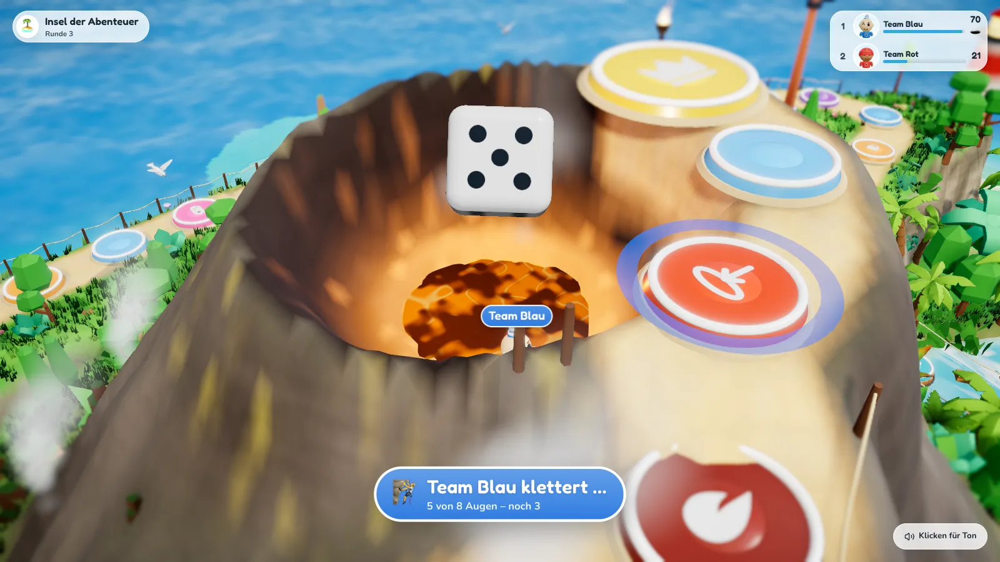

# Spielregeln

## Ziel

Alle Teams starten im **Hafendorf** (Feld 0). Der Weg führt über den Strand, durch die Tempelruinen, an der Lagune vorbei in den Dschungel und am Fluss entlang, über die **Fässer in der Furt**, hinauf zum Leuchtturm, über die **Hängebrücke** an der Schlucht, an der Steilküste entlang über die Hochebene mit den Steinköpfen und in **Serpentinen den Vulkan** hinauf. Oben geht es am **Kraterrand** entlang zum **Gipfel** (Standard: Feld 72). Wer ihn erreicht und dann noch den **Siegeswurf** schafft, gewinnt.

## Ablauf einer Runde

1. **Inhalt**: ein Spiel oder eine Frage für alle Teams.
2. **Platzierung**: Die Teams werden nach ihrem Abschneiden platziert.
3. **Bonuswürfel**: Die besten Teams bekommen einen Zusatzwürfel für die Würfelrunde (Standard: 1. Platz W6, 2. Platz W4, 3. Platz W2).
4. **Würfelrunde**: Alle Teams würfeln **in der Reihenfolge ihrer Platzierung** (Gleichstände werden ausgelost). Gezogen wird um *Würfel + Bonuswürfel*.

## Inhalte und Platzierung

| Art | Wie wird platziert? |
|---|---|
| 🎯 **Spiel** | Die Spielleitung trägt die Platzierung ein (Gleichstand möglich). |
| 🔤 **Auswahlfrage** | Richtige Antworten nach Schnelligkeit, dann falsche nach Schnelligkeit, dann ohne Antwort. |
| ✍️ **Freitextfrage** | Wie Auswahlfrage. Tolerant: Groß-/Kleinschreibung, Umlaute (ä = ae), Artikel und kleine Tippfehler werden akzeptiert. Die Spielleitung kann per Hand werten. |
| 📏 **Schätzfrage** | Kleinster Abstand zum richtigen Wert gewinnt; gleicher Abstand = gleicher Platz. |
| 🔔 **Buzzer-Frage** | Wer zuerst drückt, antwortet mündlich. Richtig → Platz 1. Falsch → das nächste Team ist dran. |

Bei Fragen gibt es Bonuswürfel standardmäßig **nur für richtige Antworten** (einstellbar).

## Würfeln und Ziehen

- Gezogen wird Feld für Feld. Am Gipfel endet der Weg (mehr Augen verfallen).
- Ein Sonderfeld wirkt nur, wenn ein Team **darauf stehen bleibt**. Wird ein Team durch ein Sonderfeld bewegt, löst das Zielfeld **nichts** aus (keine Kettenreaktionen).

## Sonderfelder

| Feld | Wirkung (Standardwerte) |
|---|---|
| 🚀 **Katapult vorwärts** (grün) | Das Team fliegt 3–5 Felder nach vorne. |
| 💥 **Katapult rückwärts** (rot) | Das Team fliegt 3–6 Felder zurück. |
| 🔄 **Platztausch** (lila) | Tauscht die Position mit einem zufälligen Team, bevorzugt mindestens 3 Felder entfernt. |
| 🚧 **Sperre** (orange) | Das Team sitzt im Käfig fest. Zum Befreien muss der **normale Würfel** eine **4, 5 oder 6** zeigen – dann wird sofort um die ganze Augenzahl gezogen. Nach **3 Fehlversuchen** öffnet sich die Sperre von selbst (Zug verfällt). |
| 🎮 **Minispiel-Feld** (pink) | Ein kurzes Feld-Minispiel: *allein gegen alle* oder *Duell* gegen ein Team. Gewinnt das Team, zieht es **5 Felder** vor. |
| 🌋 **Vulkanfeld** (dunkelrot) | Heizt den Vulkan an: **+2 Druck**. |

Alle Werte lassen sich unter *Spiel einrichten → Regeln* ändern.

## Gefahren der Insel

Zwei Stellen gehören fest zur Insel. Sie liegen immer an derselben Stelle der Karte, egal wie viele Felder das Brett hat, und lassen sich im Editor nicht verschieben. In den Regeln kann man sie abschalten oder entschärfen.

| Feld | Wirkung (Standardwerte) |
|---|---|
| 🛢️ **Fässer im Fluss** (türkis) | Der Weg führt über große Fässer durch die Furt. Wer auf einem Fass **stehen bleibt**, muss balancieren: Mit **50 %** Wahrscheinlichkeit fällt das Team ins Wasser und **treibt 2–4 Felder** flussabwärts zurück, mindestens bis vor die Furt. Wer nur darüber hinwegzieht, bleibt trocken. |
| 🕳️ **Kraterloch** (orange-rot, kurz vor dem Gipfel) | Wer hier **stehen bleibt**, rutscht in den Krater. Ab dem nächsten Zug klettert das Team heraus: Es braucht **insgesamt 8 Augen** (Würfel + Bonuswürfel, über mehrere Würfe gesammelt). Was beim letzten Wurf übrig bleibt, läuft das Team direkt weiter. Ein Vulkanausbruch schleudert Teams aus dem Krater mit heraus. |

Die Regie kann ein Team jederzeit aus dem Krater holen (*Teams → Team antippen → Aus dem Krater holen*), genau wie aus einer Sperre.

## Der Vulkan

- Der Vulkandruck steigt **jede Runde um 1** und **auf Vulkanfeldern um 2**.
- Erreicht er das Maximum (Standard **6**), **bricht der Vulkan aus**: Alle Teams auf den **letzten 12 Feldern** vor und auf dem Gipfel werden **3–6 Felder zurückgeschleudert** – auch Teams, die gerade im Krater festsitzen. Danach beginnt der Druck wieder bei 0.
- Den aktuellen Druck zeigen Beamer, Regie und Handys an.

## Sieg

Standard („Siegeswurf“): Ein Team muss **zu Beginn seines Zuges auf dem Gipfel stehen** und dann **mindestens eine 6** würfeln (Würfel + Bonuswürfel). Klappt es nicht, bleibt es oben und versucht es nächste Runde erneut – sofern der Vulkan es nicht vorher herunterwirft.

Alternativ einstellbar:

- **Sofortsieg**: Wer den Gipfel erreicht, gewinnt sofort.
- **Genau treffen**: Der Gipfel muss exakt getroffen werden, sonst prallt die Figur zurück.

Die Spielleitung kann das Spiel auch jederzeit beenden – dann gewinnt das Team, das am weitesten oben steht.
