# Spielregeln

## Ziel

Alle Teams starten im **Hafendorf** (Feld 0). Der Weg führt über den Strand, durch die Tempelruinen, an der Lagune vorbei in den Dschungel und am Fluss entlang, über die **Fässer in der Furt**, hinauf zum Leuchtturm, über die **Hängebrücke** an der Schlucht, an der Steilküste entlang über die Hochebene mit den Steinköpfen und in **Serpentinen den Vulkan** hinauf. Oben geht es am **Kraterrand** entlang zum **Gipfel** (Standard: Feld 72). Wer ihn erreicht und dann noch den **Siegeswurf** schafft, gewinnt.

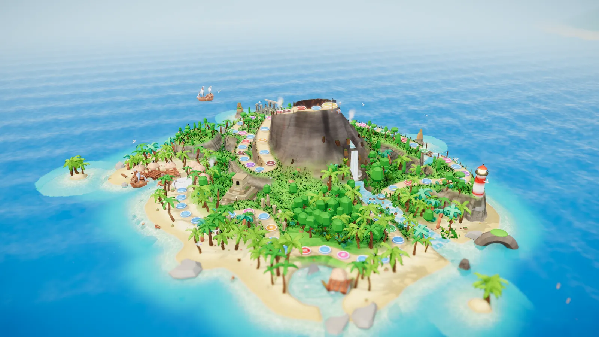

## Ablauf einer Runde

1. **Inhalt**: ein Spiel oder eine Frage für alle Teams.
2. **Platzierung**: Die Teams werden nach ihrem Abschneiden platziert.
3. **Bonuswürfel**: Die besten Teams bekommen einen Zusatzwürfel für die Würfelrunde (Standard: 1. Platz W6, 2. Platz W4, 3. Platz W2).
4. **Würfelrunde**: Alle Teams würfeln **in der Reihenfolge ihrer Platzierung** (Gleichstände werden ausgelost). Gezogen wird um *Würfel + Bonuswürfel*.

## Inhalte und Platzierung

| Art | Wie wird platziert? |
|---|---|
| 🎯 **Spiel** | Die Spielleitung trägt die Platzierung ein (Gleichstand möglich). |
| 🔤 **Auswahlfrage** | Richtige Antworten nach Schnelligkeit, dann falsche nach Schnelligkeit, dann ohne Antwort. |
| ✍️ **Freitextfrage** | Wie Auswahlfrage. Tolerant: Groß-/Kleinschreibung, Umlaute (ä = ae), Artikel und kleine Tippfehler werden akzeptiert. Die Spielleitung kann per Hand werten. |
| 📏 **Schätzfrage** | Kleinster Abstand zum richtigen Wert gewinnt; gleicher Abstand = gleicher Platz. |
| 🔔 **Buzzer-Frage** | Wer zuerst drückt, antwortet mündlich. Richtig → Platz 1. Falsch → das nächste Team ist dran. |

Bei Fragen gibt es Bonuswürfel standardmäßig **nur für richtige Antworten** (einstellbar).

## Würfeln und Ziehen

- Gezogen wird Feld für Feld. Am Gipfel endet der Weg (mehr Augen verfallen).
- Ein Sonderfeld wirkt nur, wenn ein Team **darauf stehen bleibt**. Wird ein Team durch ein Sonderfeld bewegt, löst das Zielfeld **nichts** aus (keine Kettenreaktionen).

## Sonderfelder

| Feld | Wirkung (Standardwerte) |
|---|---|
| 🚀 **Katapult vorwärts** (grün) | Das Team fliegt 3–5 Felder nach vorne. |
| 💥 **Katapult rückwärts** (rot) | Das Team fliegt 3–6 Felder zurück. |
| 🔄 **Platztausch** (lila) | Tauscht die Position mit einem zufälligen Team, bevorzugt mindestens 3 Felder entfernt. |
| 🚧 **Sperre** (orange) | Das Team sitzt im Käfig fest. Zum Befreien muss der **normale Würfel** eine **4, 5 oder 6** zeigen – dann wird sofort um die ganze Augenzahl gezogen. Nach **3 Fehlversuchen** öffnet sich die Sperre von selbst (Zug verfällt). |
| 🎮 **Minispiel-Feld** (pink) | Ein kurzes Feld-Minispiel: *allein gegen alle* oder *Duell* gegen ein Team. Gewinnt das Team, zieht es **5 Felder** vor. |
| 🌋 **Vulkanfeld** (dunkelrot) | Heizt den Vulkan an: **+2 Druck**. |
| 💀 **Totenkopf** (dunkelviolett) | Der Boden bricht ein – das Team fällt **ins Innere des Vulkans** (siehe unten). Standard: 2 Totenkopf-Felder in der Mitte der Strecke (bei kurzen Brettern 1 oder keins). |

Alle Werte lassen sich unter *Spiel einrichten → Regeln* ändern.

## Mutproben und besondere Orte

Vier Stellen gehören fest zur Insel. Sie liegen immer an derselben Stelle der Karte, egal wie viele Felder das Brett hat, und lassen sich im Editor nicht verschieben. Drei davon sind **Mutproben** wie im Original (Wii Party U, „Board Game Island“): Hier hält **jedes Team an, das vorbeikommt** – auch mitten im Wurf. Was vom Wurf übrig ist, wird gemerkt. In den Regeln kann man jede Mutprobe abschalten oder anpassen.

| Ort | Wirkung (Standardwerte) |
|---|---|
| 🌿 **Liane** (grün, am Eingang der Tempelruinen) | Hinter dem Lianenfeld fließt ein **Bach** – vorbei kommt man nur mit der Liane. Jedes Team hält an, schnappt sich die Liane und **würfelt, wie weit es schwingt** (W6, am Handy durch Schütteln oder Tippen). Danach läuft es mit dem **Rest seines Wurfs** weiter. |
| 🛢️ **Fässer oder Kisten** (türkis, am Wasserfall) | Vor dem Fluss hält jedes Team am Ufer an und **wählt am Handy: Fässer oder Kisten?** Mit **50 %** Wahrscheinlichkeit **bricht die gewählte Seite ein**: Das Team fällt ins Wasser, schwimmt ans andere Ufer, und der **restliche Wurf verfällt**. Hält die Seite, kommt es trocken hinüber und läuft mit dem Rest des Wurfs weiter. Die Felder im Fluss selbst zählen nicht – das Überqueren kostet keine Augen. |
| 🦇 **Lavahöhle** (braun, an den Serpentinen) | „Vulkan oder nicht“: Jedes Team hält an der Höhle an und würfelt. Mit **mindestens einer 3** geht es mit dem Rest des Wurfs weiter, sonst fällt es **ins Innere des Vulkans**. |
| 🕳️ **Kraterloch** (orange-rot, kurz vor dem Gipfel) | Wer hier **stehen bleibt**, rutscht in den Krater. Ab dem nächsten Zug klettert das Team heraus: Es braucht **insgesamt 8 Augen** (Würfel + Bonuswürfel, über mehrere Würfe gesammelt). Was beim letzten Wurf übrig bleibt, läuft das Team direkt weiter. Ein Vulkanausbruch schleudert Teams aus dem Krater mit heraus. |

### Das Innere des Vulkans

Wer an der Lavahöhle zu klein würfelt oder auf einem Totenkopf landet, fällt durch ein Loch ins **Innere des Vulkans**: eine Höhle mit Lavasee, Felssäulen und einem Lavafall. Dort läuft das Team einen **Strafweg von 9 Feldern** über die Felssäulen (ab dem nächsten Zug mit dem normalen Würfel).

- Landet das Team **genau auf dem leuchtenden Ausgangsfeld** (Feld 4), darf es **sofort heraus**.
- Sonst muss es den Weg bis zum Ende laufen; überzählige Augen verfallen.
- Danach bringt es ein grünes Portal **zurück an die Stelle, an der es hineingefallen ist**.
- Im Vulkan ist man vor **UFO-Platztausch** und **Vulkanausbruch** sicher.

Länge des Strafwegs und Lage des Ausgangsfelds lassen sich unter *Regeln → Vulkan-Inneres* einstellen (0 = ohne Ausgangsfeld).

Die Regie kann ein Team jederzeit aus dem Krater holen (*Teams → Team antippen → Aus dem Krater holen*), genau wie aus einer Sperre.

## Was auf dem Beamer passiert

Jedes Sonderfeld hat seinen eigenen Auftritt:

| Feld | Auftritt |
|---|---|
| 🚀 Katapult vorwärts | Eine **Sprungfeder** wächst aus dem Feld, drückt sich zusammen – *boing!* – und schleudert die Figur nach vorne. |
| 💥 Katapult rückwärts | Ein **Doppeldecker** fliegt heran, die Figur hält sich an der Strickleiter fest, wird zurückgetragen und schwebt am **Fallschirm** herab. |
| 🔄 Platztausch | Ein **UFO** beamt die erste Figur mit dem Traktorstrahl hoch, fliegt zum anderen Team, tauscht und setzt beide wieder ab. |
| 🚧 Sperre | Ein **Käfig fällt vom Himmel**; beim Befreien fliegt er davon. |
| 🎮 Minispiel-Feld | Ein schwebendes **Minispiel-Schild** mit Scheinwerfern und Konfetti erscheint über dem Feld. |
| 🌋 Vulkanfeld | Ein **Dampf-Geysir** mit Funken schießt aus dem Boden, die Erde bebt. |
| 🌿 Liane | Die Figur packt die Liane am Riesenbaum, baumelt über dem Bach, bis gewürfelt ist, und fliegt dann in hohem Bogen hinüber. |
| 🛢️ Fässer oder Kisten | Am Ufer steht ein Wegweiser, die Figur schaut zwischen beiden Wegen hin und her. Dann hüpft sie über die schwimmenden Fässer bzw. Kisten – oder das Teil zerbirst unter ihr, Bretter fliegen, Platsch, und sie schwimmt ans andere Ufer. |
| 🦇 Lavahöhle | Die Figur erschrickt am glühenden Höhleneingang. Bei zu kleinem Wurf stolpert sie hinein, Fledermäuse flattern heraus. |
| 💀 Totenkopf | Unter der Figur öffnet sich ein glühendes Loch, sie stürzt hinein. |
| 🌋 Vulkan-Inneres | Der Beamer wechselt in die Vulkanhöhle: Die Figur fällt von oben auf die erste Felssäule, hüpft dort von Säule zu Säule, verschwindet im grünen Wirbel und taucht auf der Insel in einem grünen Lichtstrahl wieder auf. Im Vulkan läuft eigene Musik. |
| 🕳️ Krater | Sturz in den Krater und Klettern an der Strickleiter. |

Nach **jedem Zug** fährt die Kamera kurz zur Figur, und sie **reagiert**: Salto nach einem großen Satz, Jubel, Winken, Schulterzucken bei einer Eins, Stampfen vor Ärger, Erschrecken oder Trauer nach einem Rückschlag. Werden Personen für ein Spiel gezogen, fliegen ihre **Fotos als große Blasen** über den Beamer. Ein **Kommentator** begleitet das Spiel mit Sprüchen (in der Regie einstellbar).

Mitgespielt wird mit **Handy, Tablet oder Laptop** – jedes Gerät mit Browser geht. Bei Fragen mit Antwortmöglichkeiten genügt **doppelt Tippen** (am Laptop: Doppelklick) auf eine Antwort – sie ist sofort eingeloggt und abgeschickt, ohne extra „Antwort bestätigen“.

| | |
|---|---|
| 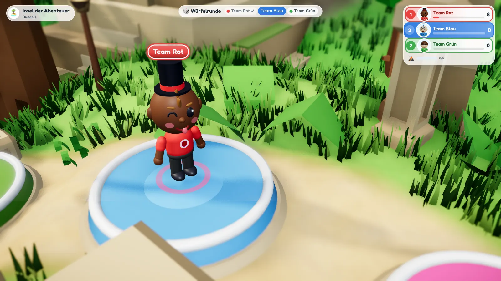 | 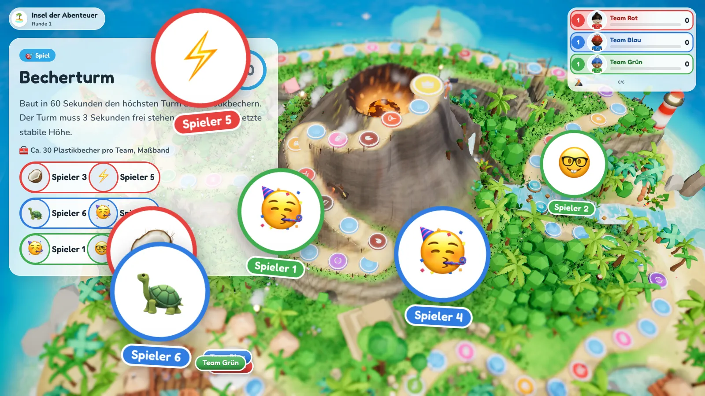 |
| 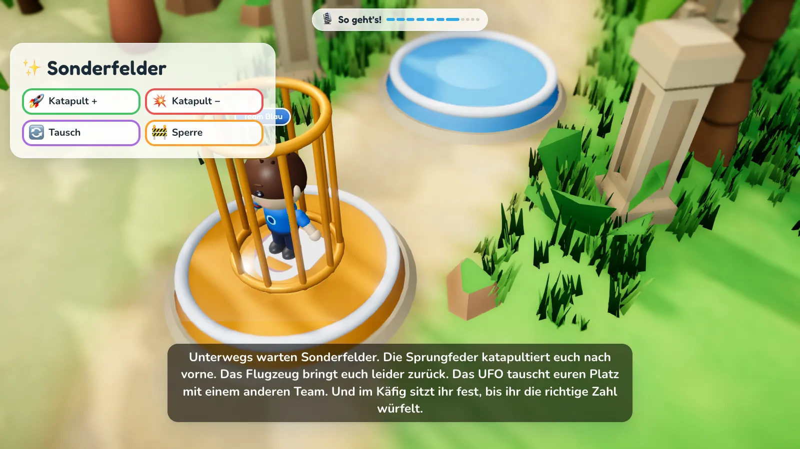 | 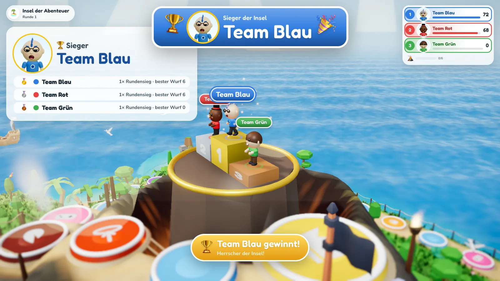 |

| | |
|---|---|
| 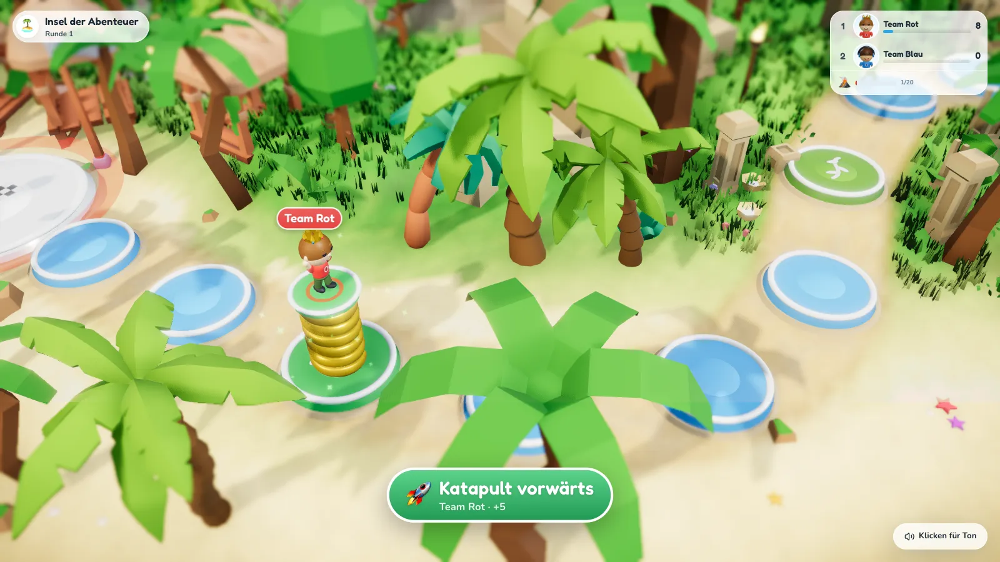 | 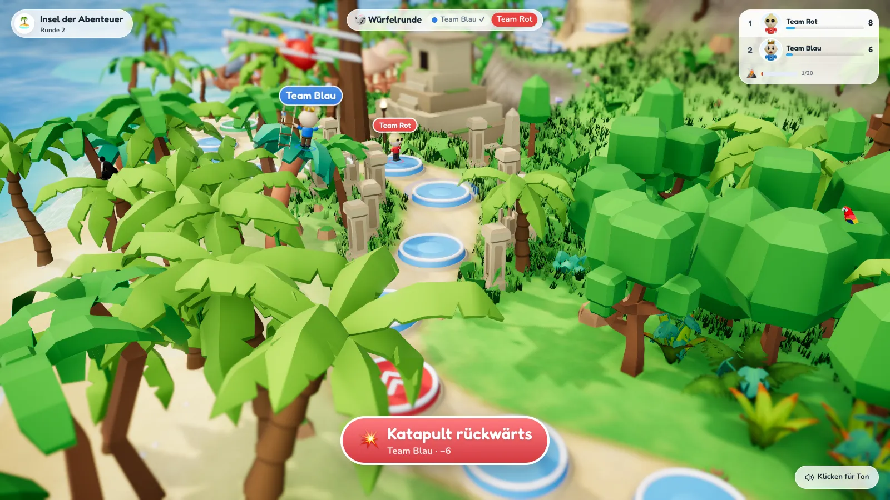 |
| 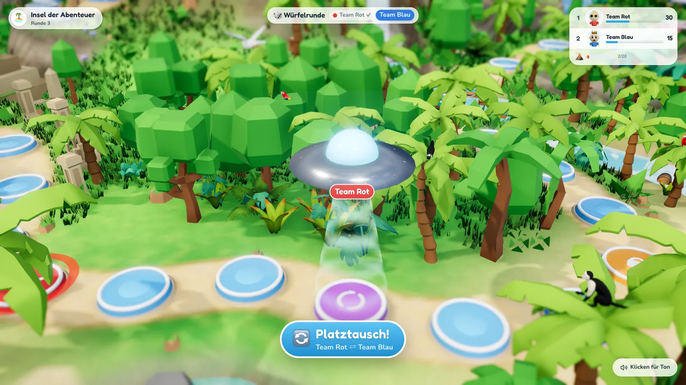 | 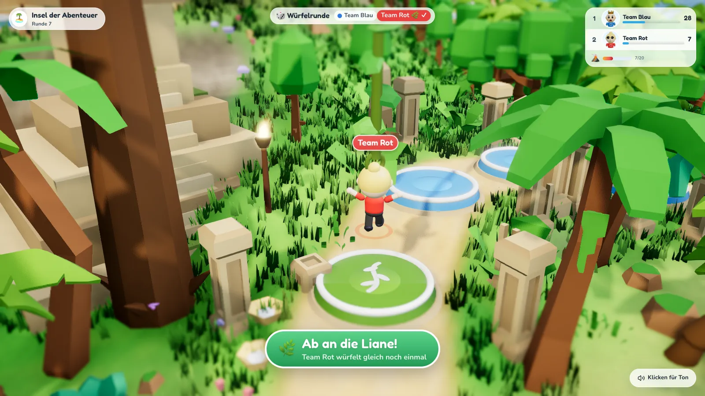 |
| 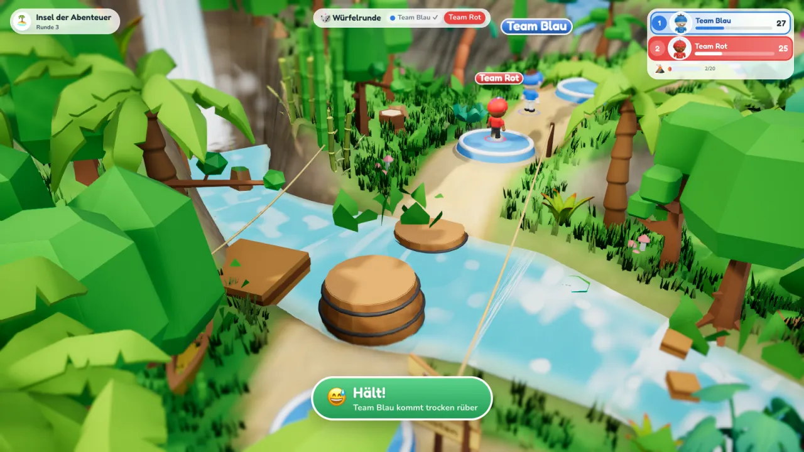 | 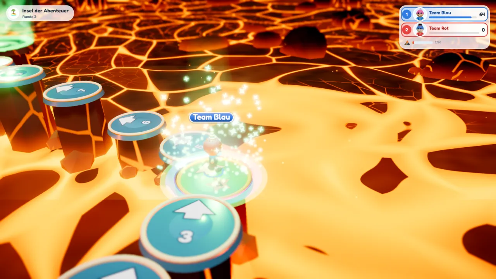 |

## Der Vulkan

- Der Vulkandruck steigt **jede Runde um 1** und **auf Vulkanfeldern um 2**.
- Erreicht er das Maximum (Standard **6**), **bricht der Vulkan aus**: Alle Teams auf den **letzten 12 Feldern** vor und auf dem Gipfel werden **3–6 Felder zurückgeschleudert** – auch Teams, die gerade im Krater festsitzen (nicht aber Teams im Vulkan-Inneren). Danach beginnt der Druck wieder bei 0.
- Den aktuellen Druck zeigen Beamer, Regie und Handys an.

## Sieg

Standard („Siegeswurf“): Ein Team muss **zu Beginn seines Zuges auf dem Gipfel stehen** und dann **mindestens eine 6** würfeln (Würfel + Bonuswürfel). Klappt es nicht, bleibt es oben und versucht es nächste Runde erneut – sofern der Vulkan es nicht vorher herunterwirft.

Alternativ einstellbar:

- **Sofortsieg**: Wer den Gipfel erreicht, gewinnt sofort.
- **Genau treffen**: Der Gipfel muss exakt getroffen werden, sonst prallt die Figur zurück.

Die Spielleitung kann das Spiel auch jederzeit beenden – dann gewinnt das Team, das am weitesten oben steht.
